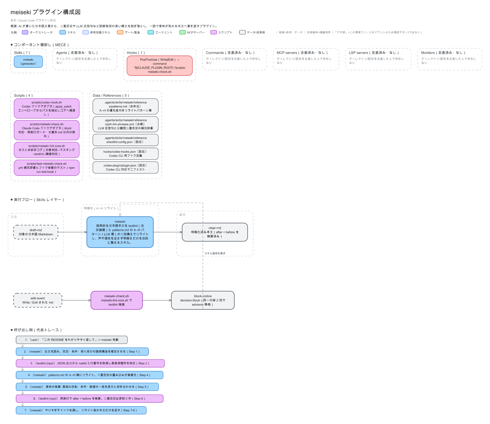
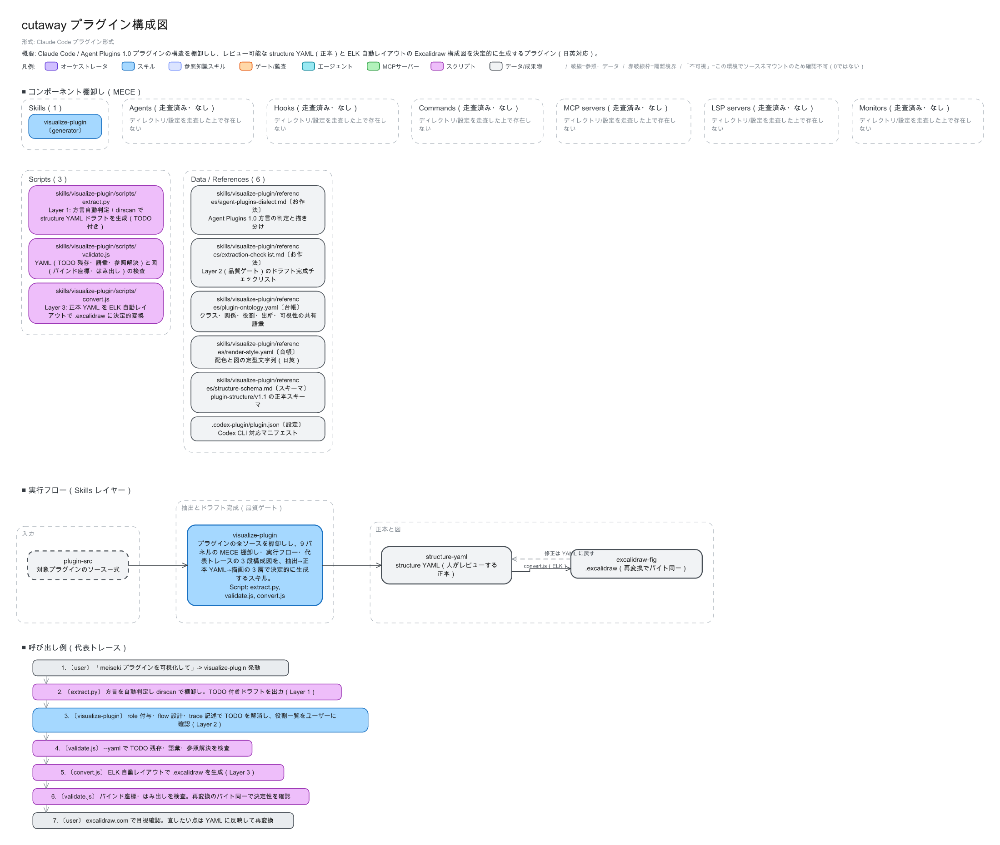
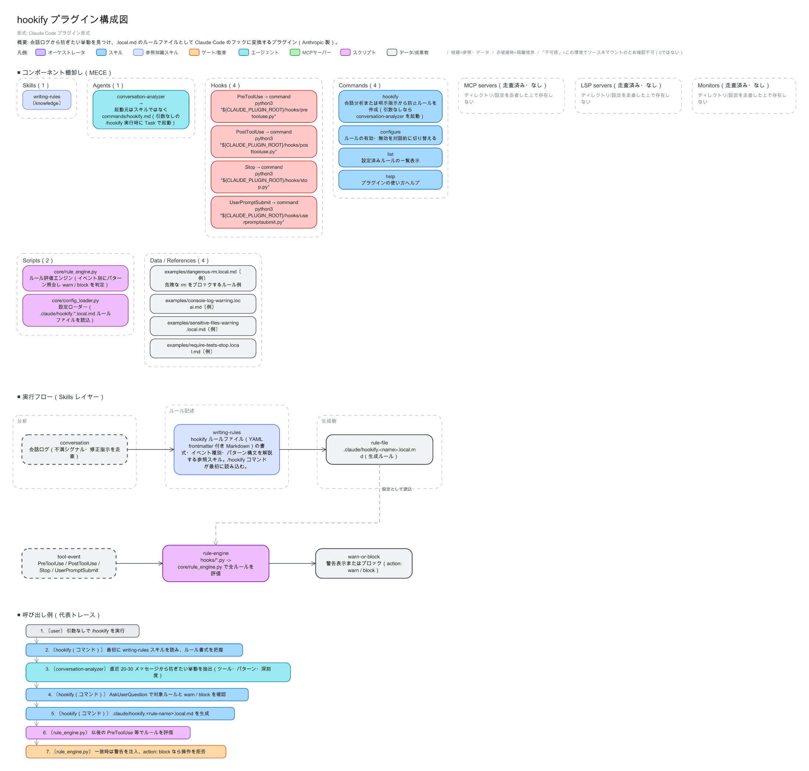
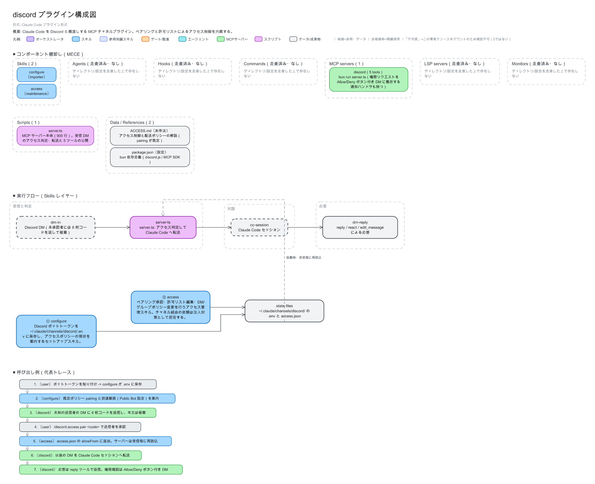

# cutaway

[English](./README.md) | **日本語**

Claude Code プラグイン／Agent Plugins 1.0 の構造を棚卸しするプラグイン。
レビュー可能な **structure YAML（正本）** と **Excalidraw 構成図** を決定的に生成する。

## 3層アーキテクチャ

```
[Layer 1: 抽出]  プラグインソース ──(extract.py: dirscan+manifest+SKILL.md精読)──▶
[Layer 2: 正本]  structures/structure-<plugin>.yaml（plugin-structure/v1.1、人がレビュー）──▶
[Layer 3: 描画]  convert.js（ELK自動レイアウト）──▶ out/<plugin>.excalidraw ──▶ excalidraw.com で微調整
```

- **構造変更＝YAML差分**としてレビューできることが核心価値。
- 同じ YAML からは必ずバイト同一の図が出る（乱数・時刻は入力ハッシュseedに固定）。
- 全項目に provenance と visibility が付く。前者は manifest / dirscan / skillmd-mention /
  user-report / inferred の5値。後者は verified / verified_empty / not_visible の3値。
  **「0」と「不可視」を混同しない。**
- 二言語対応: structure YAML の `lang` フィールド（en / ja）で図の定型文字列が切り替わる。
  本文もその言語で書き、日英同品質で出力する。

## 出力例

cutaway 自身で 4 つの実プラグインを可視化した例（`--lang ja`）。
後半 2 つは Anthropic の公式プラグインディレクトリから取った。
PNG は .excalidraw ファイルからローカルで描画したもの。
全例の英語版は [docs/examples/en/](docs/examples/en/) にある。

### meiseki（スキル 1 ＋ PostToolUse フック構成）



元データ: [structure YAML](docs/examples/ja/structure-meiseki.yaml) /
[.excalidraw](docs/examples/ja/meiseki.excalidraw)

### cutaway（自己可視化）



元データ: [structure YAML](docs/examples/ja/structure-cutaway.yaml) /
[.excalidraw](docs/examples/ja/cutaway.excalidraw)

### hookify（公式ディレクトリ・Anthropic 製）



元データ: [structure YAML](docs/examples/ja/structure-hookify.yaml) /
[.excalidraw](docs/examples/ja/hookify.excalidraw)

### discord（公式ディレクトリ・パートナー製）



元データ: [structure YAML](docs/examples/ja/structure-discord.yaml) /
[.excalidraw](docs/examples/ja/discord.excalidraw)

空のカテゴリも「走査済み・なし」としてパネルに残る。0 を黙って消さないのが規律。

## 対応方言

| dialect | マニフェスト | MCP設定 | 備考 |
|---|---|---|---|
| claude-code | `.claude-plugin/plugin.json` | `.mcp.json` / manifest内 | agents/hooks/commands/LSP/monitors も棚卸し |
| agent-plugins-1.0 | ルート `plugin.json`（closed schema） | `mcp.json` | 標準スコープ外の実体は「（標準スコープ外）」表示 |

詳細: `skills/visualize-plugin/references/agent-plugins-dialect.md`

## インストール

### 前提

- Node.js v18+（elkjs / js-yaml。初回に `scripts/` で `npm ci`）
- uv（extract.py の実行に使用。PyYAML は inline 依存で自動解決）

### Claude Code プラグインとして使う

`claude plugin install` は**マーケットプレイスに登録されたプラグイン名**を取る（パスは取らない）。
そのため、まず同梱の `.claude-plugin/marketplace.json` を登録し、その名前で install する。

```bash
# 1. このプラグインのマーケットプレイスを登録
claude plugin marketplace add ./cutaway

# 2. 「プラグイン名@マーケットプレイス名」で install
claude plugin install cutaway@cutaway
```

GitHub からインストールする場合は、手順1のパスを `owner/repo` 形式に変えるだけ：

```bash
# 1. GitHub リポジトリをマーケットプレイスとして登録（タグ固定は #v0.1.0 のように付ける）
claude plugin marketplace add bamboo-nova/cutaway

# 2. install コマンドは同じ
claude plugin install cutaway@cutaway
```

GitHub 由来のマーケットプレイスは自動更新が有効。手動更新は `claude plugin marketplace update cutaway`。

開発中にインストールせず一時的に読み込むだけなら、こちらが手軽：

```bash
claude --plugin-dir ./cutaway
```

> マニフェストの検証は `claude plugin validate ./cutaway` で行える（検証パス確認済み）。

### Codex CLI プラグインとして使う

Codex CLI（0.150 系で確認）は Agent Skills 標準とプラグイン機構を持つ。
同梱の `.codex-plugin/plugin.json` でそのまま読み込める。

```bash
# 1. このリポジトリをマーケットプレイスとして登録（Claude 用 marketplace.json を Codex も読める）
codex plugin marketplace add ./cutaway

# 2. install（バージョンは .codex-plugin/plugin.json から解決される）
codex plugin add cutaway@cutaway
```

導入後は「◯◯プラグインを可視化して」「構成図を作って」で `visualize-plugin` スキルが発動する。

## Quickstart

```bash
cd skills/visualize-plugin/scripts
npm ci                                             # elkjs / js-yaml（.npmrc で min-release-age=7）

uv run extract.py <plugin-root> -o ../../../structures/structure-<name>.yaml --lang ja
#（ドラフトの TODO(Claude) を references/extraction-checklist.md に従って完成させる）
node validate.js --yaml ../../../structures/structure-<name>.yaml
node convert.js ../../../structures/structure-<name>.yaml -o ../../../out/<name>.excalidraw
node validate.js ../../../out/<name>.excalidraw
```

スキル経由の詳細ワークフローは `skills/visualize-plugin/SKILL.md` を参照。

## ディレクトリ

- `skills/visualize-plugin/` — スキル本体（scripts / references / assets/fixtures）
- `structures/` — 各プラグインの structure YAML 正本
- `out/` — 生成された .excalidraw
- `convert5.js` — プロトタイプ期の凍結参照

## 謝辞

- 可視化例のうち 2 つは、Anthropic の公式ディレクトリ
  [claude-plugins-official](https://github.com/anthropics/claude-plugins-official)
  に収録されたプラグインを使わせていただいた。
  [hookify](https://github.com/anthropics/claude-plugins-official/tree/main/plugins/hookify)
  （Anthropic 製）と
  [discord](https://github.com/anthropics/claude-plugins-official/tree/main/external_plugins/discord)
  （パートナー製）の作者に感謝する。
- レイアウトは [elkjs](https://github.com/kieler/elkjs)（Eclipse Layout Kernel）、
  YAML 処理は [js-yaml](https://github.com/nodeca/js-yaml) を利用している。
  図の形式は [Excalidraw](https://github.com/excalidraw/excalidraw) に依る。
  各 OSS の作者・コミュニティに感謝する。ライセンスは各パッケージのものに従う。

## 免責事項

- 本プラグインは「現状有姿（AS IS）」で提供され、出力の正確性・完全性・
  特定目的への適合性について**いかなる保証もしない**。
- 構成図と structure YAML は機械抽出＋ドラフト完成による棚卸しの成果物であり、
  コンポーネントの見落としや役割の誤分類がありえる。
  **監査やセキュリティ判断に使う前に、必ず一次ソースで確認すること。**
- docs/examples/ の第三者プラグイン（hookify・discord）の図は 2026-08-30 時点の
  リポジトリ内容に基づく。各作者や Anthropic による承認・提携を意味しない。
- 本プラグインの使用または使用不能から生じた直接・間接のいかなる損害についても、
  作者は責任を負わない（詳細は `LICENSE` を参照）。
- 本プラグインは elkjs / js-yaml など第三者 OSS に依存する。
  依存パッケージの動作・セキュリティは各提供元の規約・ライセンスに従う。
