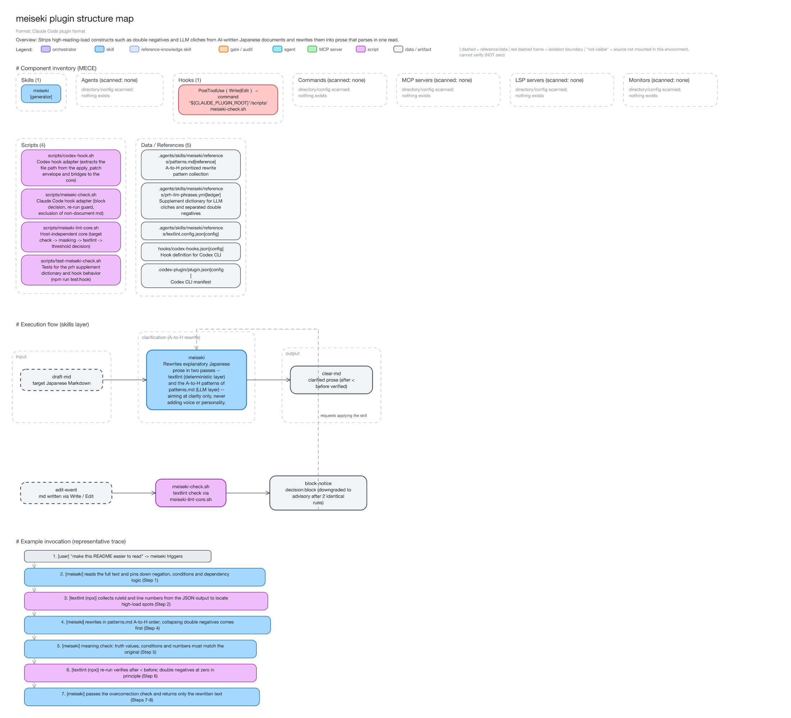
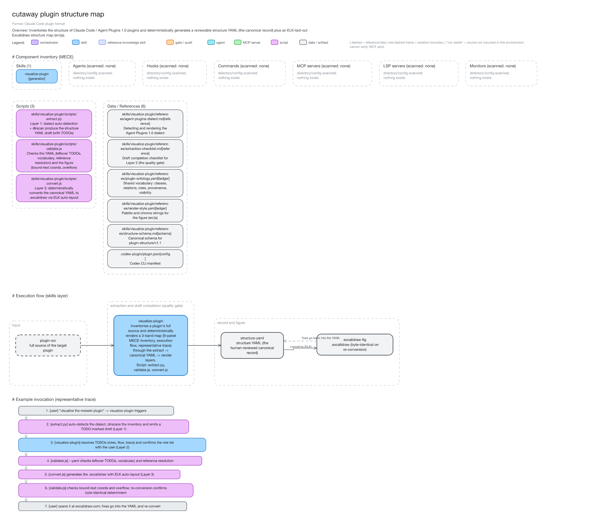
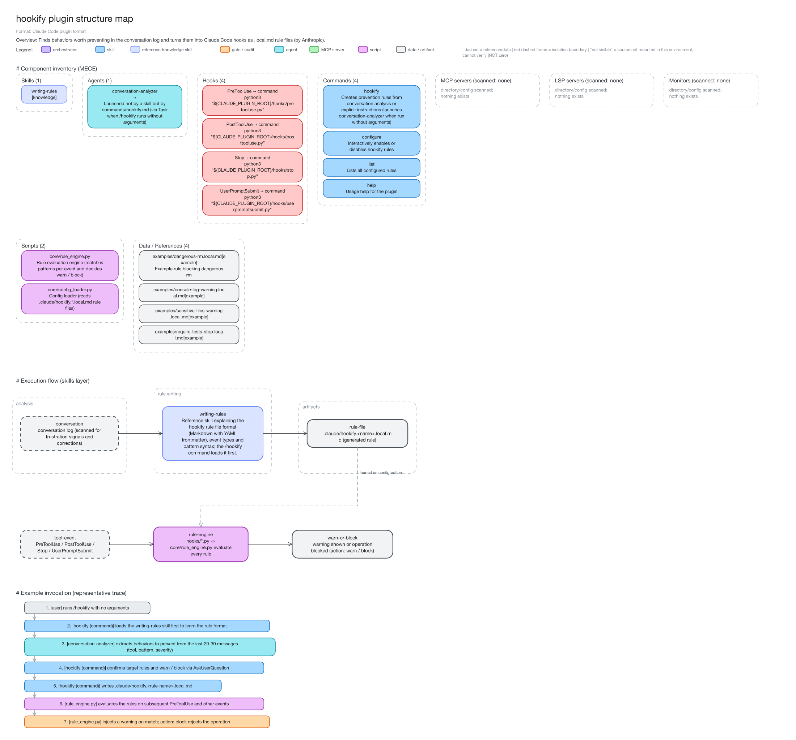
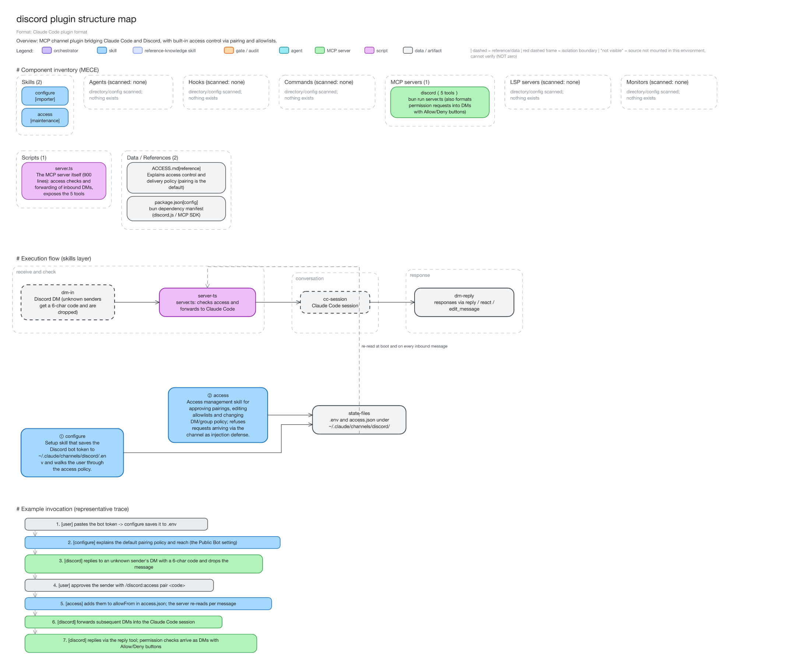

# cutaway

**English** | [日本語](./README.ja.md)

Inventories the structure of Claude Code plugins and Agent Plugins 1.0 plugins.
From that inventory it deterministically generates two artifacts.
One is a reviewable **structure YAML**, the canonical record.
The other is an **Excalidraw structure map**.

## Three-layer architecture

```
[Layer 1: extract]  plugin sources --(extract.py: dirscan + manifest + SKILL.md close-read)-->
[Layer 2: canon]    structures/structure-<plugin>.yaml  (plugin-structure/v1.1, reviewed by humans)
[Layer 3: render]   convert.js (ELK auto-layout) --> out/<plugin>.excalidraw --> polish at excalidraw.com
```

- **Structural change = a YAML diff.** That is the core value of this plugin.
- The same YAML always produces byte-identical figures.
  Randomness and time are fixed to a hash seed of the input.
- Every item carries two tags. **Never confuse "zero" with "not visible".**
  - provenance: manifest / dirscan / skillmd-mention / user-report / inferred
  - visibility: verified / verified_empty / not_visible
- Bilingual output. The structure YAML's `lang` field (en / ja) switches all
  chrome strings in the figure. Content is authored in the same language at
  equal quality.

## Example output

Four real plugins, visualized by cutaway itself (`--lang en`).
The last two come from Anthropic's official plugin directory.
The PNGs are rendered locally from the .excalidraw files.
Japanese versions of every example live in [docs/examples/ja/](docs/examples/ja/).

### meiseki (one skill + a PostToolUse hook)



Sources: [structure YAML](docs/examples/en/structure-meiseki.yaml) /
[.excalidraw](docs/examples/en/meiseki.excalidraw)

### cutaway (self-portrait)



Sources: [structure YAML](docs/examples/en/structure-cutaway.yaml) /
[.excalidraw](docs/examples/en/cutaway.excalidraw)

### hookify (official plugin directory, by Anthropic)



Sources: [structure YAML](docs/examples/en/structure-hookify.yaml) /
[.excalidraw](docs/examples/en/hookify.excalidraw)

### discord (official plugin directory, partner plugin)



Sources: [structure YAML](docs/examples/en/structure-discord.yaml) /
[.excalidraw](docs/examples/en/discord.excalidraw)

Empty categories stay on the canvas as "scanned, none". A zero is never silently dropped.

## Supported dialects

| dialect | manifest | MCP config | notes |
|---|---|---|---|
| claude-code | `.claude-plugin/plugin.json` | `.mcp.json` / inline in manifest | agents/hooks/commands/LSP/monitors inventoried too |
| agent-plugins-1.0 | root `plugin.json` (closed schema) | `mcp.json` | out-of-scope entities labeled "(out of spec)" |

Details: `skills/visualize-plugin/references/agent-plugins-dialect.md`

## Installation

### Prerequisites

- Node.js v18+ (elkjs / js-yaml; run `npm ci` in `scripts/` once)
- uv (runs extract.py; PyYAML resolves via inline script deps)

### As a Claude Code plugin

`claude plugin install` takes a **marketplace-registered plugin name**, not a path.
So first register the bundled `.claude-plugin/marketplace.json` as a marketplace.
Then install by name:

```bash
# 1. register this plugin's marketplace (.claude-plugin/marketplace.json)
claude plugin marketplace add ./cutaway

# 2. install as "<plugin>@<marketplace>"
claude plugin install cutaway@cutaway
```

To install from GitHub instead, just swap the path in step 1 for `owner/repo`:

```bash
# 1. register the GitHub repository as a marketplace (pin a tag with #v0.1.0 if needed)
claude plugin marketplace add bamboo-nova/cutaway

# 2. same install command
claude plugin install cutaway@cutaway
```

Marketplaces added from GitHub auto-update by default.
To update manually, run `claude plugin marketplace update cutaway`.

For a temporary load during development:

```bash
claude --plugin-dir ./cutaway
```

> Validate the manifest with `claude plugin validate ./cutaway` (verified passing).

### As a Codex CLI plugin

Codex CLI (verified on 0.150.x) understands the Agent Skills standard.
It loads this plugin via the bundled `.codex-plugin/plugin.json`:

```bash
# 1. register this repository as a marketplace (Codex reads the Claude marketplace.json)
codex plugin marketplace add ./cutaway

# 2. install (version resolves from .codex-plugin/plugin.json)
codex plugin add cutaway@cutaway
```

After install, say "visualize this plugin" or "plugin structure map"
(「◯◯プラグインを可視化して」).
Either phrase triggers the `visualize-plugin` skill.

## Quickstart

```bash
cd skills/visualize-plugin/scripts
npm ci                                             # elkjs / js-yaml (.npmrc: min-release-age=7)

uv run extract.py <plugin-root> -o ../../../structures/structure-<name>.yaml --lang en
# (complete the draft's TODO(Claude) markers per references/extraction-checklist.md)
node validate.js --yaml ../../../structures/structure-<name>.yaml
node convert.js ../../../structures/structure-<name>.yaml -o ../../../out/<name>.excalidraw
node validate.js ../../../out/<name>.excalidraw
```

See `skills/visualize-plugin/SKILL.md` for the full skill-driven workflow.

## Directory layout

- `skills/visualize-plugin/` — the skill (scripts / references / assets/fixtures)
- `structures/` — canonical structure YAML per visualized plugin
- `out/` — generated .excalidraw figures
- `convert5.js` — frozen prototype kept for reference

## Acknowledgements

- Two example figures come from Anthropic's official
  [claude-plugins-official](https://github.com/anthropics/claude-plugins-official) directory.
  Thanks to the authors of
  [hookify](https://github.com/anthropics/claude-plugins-official/tree/main/plugins/hookify)
  (by Anthropic) and
  [discord](https://github.com/anthropics/claude-plugins-official/tree/main/external_plugins/discord)
  (a partner plugin).
- Layout by [elkjs](https://github.com/kieler/elkjs) (Eclipse Layout Kernel) and YAML
  handling by [js-yaml](https://github.com/nodeca/js-yaml).
  The output format belongs to [Excalidraw](https://github.com/excalidraw/excalidraw).
  Thanks to all of these OSS communities; each package follows its own license.

## Disclaimer

- This plugin is provided "AS IS", without warranty of any kind.
- The maps and structure YAMLs are machine-extracted, human-completed inventories.
  Components can be missed and roles can be misclassified.
  Verify against the primary sources before using them for audits or security decisions.
- The third-party examples (hookify, discord) reflect their repositories as of 2026-08-30.
  They imply no endorsement by, or affiliation with, their authors or Anthropic.
- The authors accept no liability for damages arising from use of this plugin.
  See `LICENSE` for details.
- This plugin depends on third-party OSS such as elkjs and js-yaml.
  Those packages follow their own licenses and terms.
